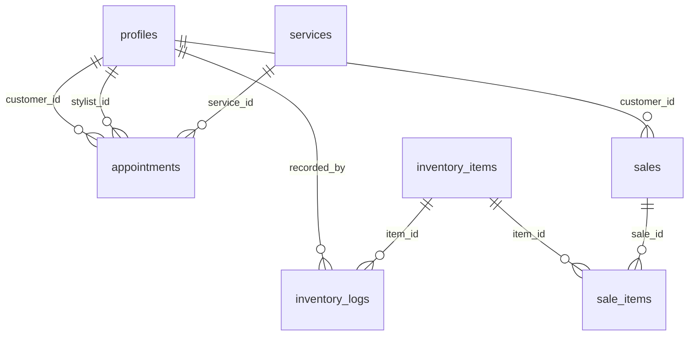

# PROJECT_GUIDE.md: GlowUp AI Salon Management

Welcome to the comprehensive guide for **GlowUp**, a premium, AI-driven salon management platform. This document covers the architecture, frontend structure, routing, database schema, and core features.

---

## 1. Project Overview
GlowUp is designed to provide a "Sanctuary of Style" where ancient grooming traditions meet futuristic intelligence. It offers a seamless experience for customers to book services, stylists to manage their schedules, and admins to run the business with AI-powered insights.

---

## 2. System Architecture
The application follows a modern serverless architecture:

*   **Frontend:** React 19 + Vite (TypeScript)
*   **Styling:** Custom CSS with the "Atelier" design system (Cream, Nude, Clay, Charcoal).
*   **Animations:** Framer Motion.
*   **Backend-as-a-Service:** Supabase (Auth, PostgreSQL, Real-time, Storage).
*   **AI Engine:** Google Gemini (Analysis, Recommendations, and Image Manifesting).

---

## 3. Frontend Sections

### A. Public Presence (Landing Page)
The landing page is the "Digital Facade" of the salon, featuring:
- **Hero**: Atmospheric entry point.
- **AI Styler (Oracle)**: Teaser for the virtual try-on feature.
- **Rituals (Services)**: Display of salon offerings.
- **Portfolio**: Visual showcase of work.
- **Contact**: Location details and inquiry form.

### B. User Workspaces
Access is role-based and requires authentication:

| Role | Key Sections |
| :--- | :--- |
| **Customer** | Booking Engine, AI Oracle (Virtual Try-on), Appointment History, Live Chat Concierge. |
| **Stylist** | Personal Schedule, Task Management, Live Chat with Clients. |
| **Admin** | Business Dashboard, AI Insights, POS System, Inventory Manager, Stylist (Artisan) Management, Master Calendar, Service Configuration. |

---

## 4. Routing & Authentication

### How Routing Works
The application uses **State-Based Routing** within [App.tsx](file:///Users/macbookair/Documents/Repositories/Uovt/glowup---ai-powered-unisex-salon-management%20%281%29/App.tsx).
- An `activeView` state determines which component is rendered.
- The `role` state (fetched from the `profiles` table) filters which views are available in the sidebar navigation.

### Authentication Flow
1. User logs in via Supabase Auth (`LoginPage`).
2. `App.tsx` listens for the auth state change.
3. On login, the user's profile is fetched to determine their `role`.
4. Based on the `role`, the user is redirected to their default workspace (e.g., Dashboard for Admins, Schedule for Stylists).

---

## 5. Database Schema & Tables

The backend is powered by **Supabase (PostgreSQL)**. Below is the ERD and table breakdown:

### Entity Relationship Diagram (ERD)

### Table Reference

- **`profiles`**: Central user table. Stores names, contacts, and roles (`admin`, `stylist`, `customer`). Stylist profiles also include bio, specialization, and ratings.
- **`services`**: Catalog of salon rituals, prices, and durations.
- **`appointments`**: The core booking table linking customers, stylists, and services.
- **`inventory_items`**: Tracked products (SKU, stock levels, prices).
- **`inventory_logs`**: Audit trail for stock movements (In/Out/Adjustment).
- **`sales` & `sale_items`**: Transaction records for the Point of Sale system.
- **`chat_messages`**: Real-time message history between users.

---

## 6. Location Handling

The salon's location is currently managed as **Static Data** within the `LandingPage.tsx` component.

- **Primary Address**: Pawa Atelier, No. 8 Esther Place, Colombo 05.
- **Context**: Described as a "Sanctuary in Soho" (Branding) / Colombo (Physical).
- **Mechanism**:
    - Displayed in the "Contact" section via the `MapPin` icon.
    - Linked to a "Guided Path" button which can be hooked into Google Maps or a similar API for navigation.

---

## 7. Core Feature Explanation

### AI Oracle (Virtual Try-On)
Uses **Google Gemini** models to analyze uploaded photos and "manifest" new hairstyles. 
- **Analysis**: Detects face shape and features.
- **Generation**: Suggests and overlays hairstyles based on the analysis.

### FIFO Inventory System
A backend logic (triggers/functions) that ensures stock is consumed in the order it was received.
- When a sale happens, it automatically finds the oldest stock in `inventory_logs` and reduces it.

### Point of Sale (POS)
A modern checkout interface that allows staff to select items/services, apply discounts, and process payments (Cash/Card/Aura). It updates inventory in real-time.

---

## 8. Development & Deployment
- **Local Dev**: `npm run dev` (Vite).
- **Environment**: Requires `.env.local` with `VITE_SUPABASE_URL`, `VITE_SUPABASE_ANON_KEY`, and `VITE_GEMINI_API_KEY`.
- **Backend**: Managed via the Supabase Dashboard (Project Ref: `nzavytneppcgxnlqccrm`).
